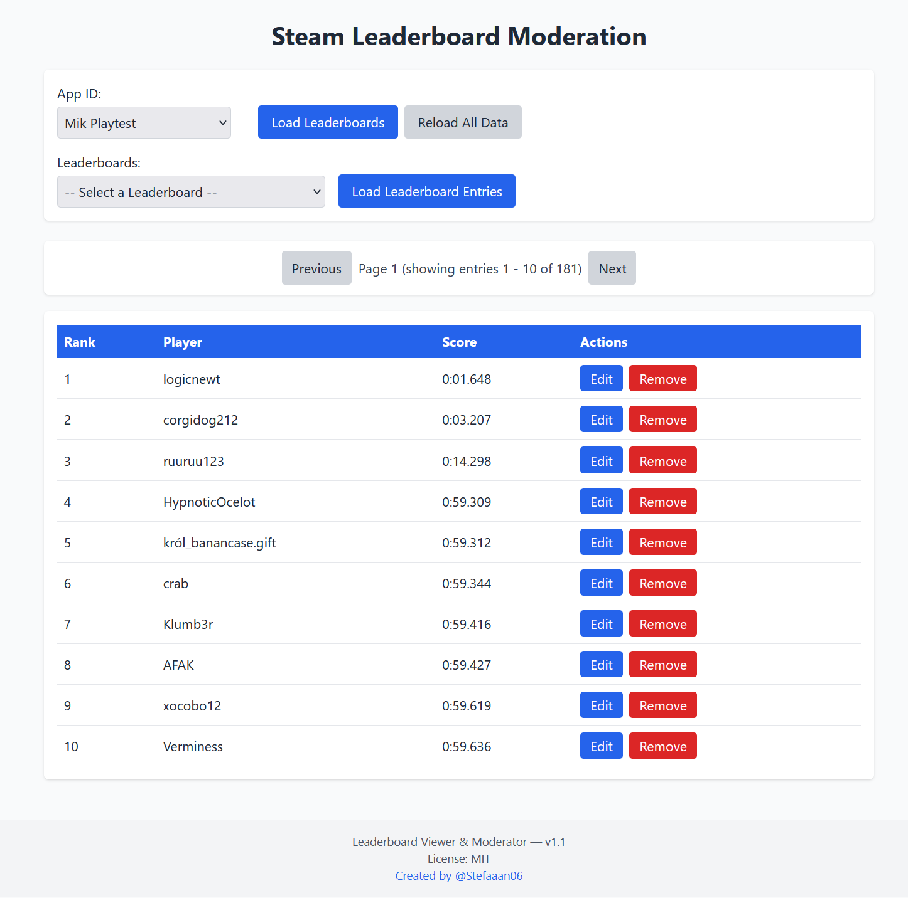

# Steam-Leaderboard-Moderation
```Version 1.1```

A web application written in Node.js interfacing with the Steam API, allowing for easy removal and editing of leaderboard entries since Steam itself lacks this feature.


## Features

- View Steam leaderboards
- Edit leaderboard entries
- Remove leaderboard entries

## Setup Guide

### Prerequisites

- Node.js (v14 or higher)
- npm (v6 or higher)
- Steamworks Partner account & API Key

### Installation

1. Clone the repository:
    ```sh
    git clone https://github.com/Stefaaan06/Steam-Leaderboard-Moderation.git
    cd Steam-Leaderboard-Moderation
    ```

2. Install dependencies:
    ```sh
    npm install
    ```

3. Create a `.env` file in the root directory and add your Steam Publisher API Key:
    ```env
    STEAM_PUBLISHER_API_KEY=your_api_key_here
    ```
    How to get your API key: https://partner.steamgames.com/doc/webapi_overview/auth


4. (optional) Update index.html with your own appID - 
   The appID in index.html is currently configured for my own game. Replace it with your own appID. You can also add multiple options
    ```html
    <select id="appidSelect">
        <option value="YOUR APP ID">YOUR APP NAME</option>
    </select>
    ```
    You can also input an appID when selecting "Custom" in the dropdown.

5. Start the server:
    ```sh
    npm start
    ```

6. Open your browser and navigate to `http://localhost:3000`.


7. You can also optionally run this on an actual server. 

## Usage Guide


### Viewing Leaderboards

1. Select an App ID from the dropdown or input your own.
2. Click "Load Leaderboards" to fetch the leaderboards for the selected App ID.
3. Select a leaderboard from the dropdown.
4. Click "Load Leaderboard Entries" to view the entries.

### Editing an Entry

1. Click the "Edit" button next to the entry you want to edit.
2. Enter the new score in the prompt.
3. Confirm the update.

### Removing an Entry

1. Click the "Remove" button next to the entry you want to remove.
2. Confirm the removal.
3. (this does not actually remove the entry but replaces it with a very large value)

### Known Issues
1. When Removing / Editing entries the displayed entries on the website don´t update properly.
2. Reload button does not reload cache

## Links

- [Steamworks Web API Keys](https://partner.steamgames.com/doc/webapi_overview)
- [Steam Leaderboards API](https://partner.steamgames.com/doc/webapi/ISteamLeaderboards)
- [Steam User API](https://partner.steamgames.com/doc/webapi/ISteamUser)

## License & Contribution

This project is licensed under the MIT License.
Any contribution is welcome and will be under the same license.
